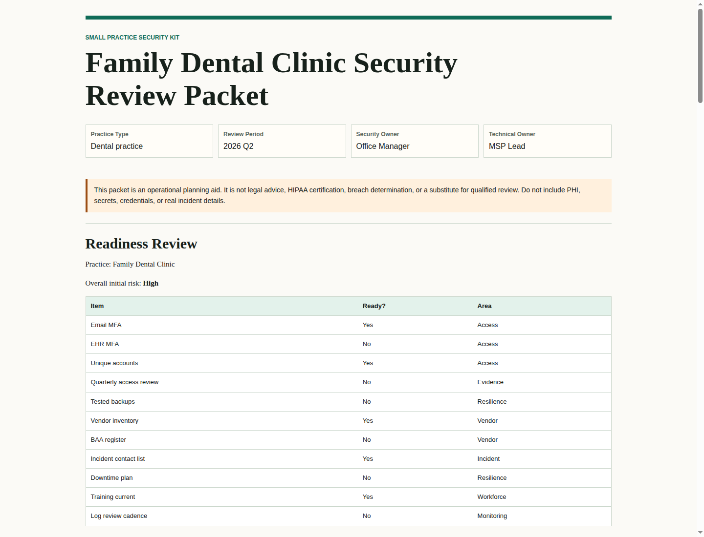

# Small Practice Security Kit

**PHI-avoidant, local-first readiness packet builder for small healthcare practices.**

This is the public Velari flagship proof repo: a local packet builder for small practice owners, practice managers, MSPs, and consultants who need a concrete evidence organization workflow before an audit conversation, renewal, AI rollout, downtime event, incident review, or owner/MSP handoff.

Start with the sanitized sample packet:

- Practice Assurance Packet: [`docs/demo/practice-assurance-packet.html`](docs/demo/practice-assurance-packet.html)
- Markdown copy: [`docs/demo/practice-assurance-packet.md`](docs/demo/practice-assurance-packet.md)
- External Evidence Pre-Check: [`docs/demo/external-evidence-precheck.md`](docs/demo/external-evidence-precheck.md)
- Complete Markdown packet: [`docs/demo/review-packet.md`](docs/demo/review-packet.md)
- Print-friendly HTML packet: [`docs/demo/review-packet.html`](docs/demo/review-packet.html)
- Screenshot: [`docs/demo/screenshots/review-packet.png`](docs/demo/screenshots/review-packet.png)
- Canonical manifest: [`docs/demo/packet-manifest.json`](docs/demo/packet-manifest.json)
- Safety boundary: [`docs/security-model.md`](docs/security-model.md)
- Release note: [`docs/releases/v0.1.0.md`](docs/releases/v0.1.0.md)



The checked-in demo uses a fictional `Family Dental Clinic` profile and contains no real PHI, credentials, private URLs, raw logs, contracts, or incident details.

Workflow:

```text
10-minute intake -> external evidence pre-check -> patient-data-outside-the-EHR map -> vendor/BAA review -> AI workflow review -> downtime/tabletop -> owner decision queue -> evidence index -> owner/MSP handoff -> 30/60/90 roadmap
```

Boundary: this is readiness and evidence organization. It does not certify HIPAA compliance, provide legal advice, make breach-notification decisions, complete a formal Security Risk Analysis, or replace qualified legal, compliance, security, MSP/IT, incident response, or insurance professionals.

## What this helps answer

Small practices often know they need MFA, backups, BAAs, access reviews, AI rules, incident procedures, downtime plans, and risk documentation. The hard part is proving what exists when evidence is scattered across email, vendor portals, tickets, screenshots, spreadsheets, and memory.

This kit helps answer:

- What can the practice owner or office manager answer in the first 10 minutes without finding raw files or touching PHI?
- What can we hand to the practice owner, MSP, vendors, and reviewers without asking the practice to manage another dashboard?
- Which public-site tracker, appointment, intake, portal, TLS, or certificate observations should become safe owner/MSP/vendor/reviewer questions before internal access is needed?
- Where does ePHI enter, move, rest, and leave?
- Which systems and vendors touch ePHI?
- Which AI workflows are allowed, restricted, or prohibited?
- Which evidence references should be collected, refreshed, or handed to an MSP?
- Which evidence is missing, requested, partial, provided, stale, blocked, ready for review, or closed?
- Which ePHI flows, systems, vendors, AI workflows, downtime steps, and incident events does each evidence item support?
- Which gaps should be handled in the next 30, 60, and 90 days?
- What can the practice owner safely show a reviewer without uploading PHI?
- What sequence of events, evidence references, decision gates, and after-action owners should be prepared after a suspicious access, downtime, vendor notice, or ransomware concern?

The strongest wedge is the **Patient Data Outside the EHR Map**: inboxes, shared drives, AI tools, vendors, portals, exports, contractors, backups, billing systems, and MSP-managed systems. Once those flows are visible, the evidence binder, vendor/BAA register, AI workflow review, and downtime plan become concrete.

## What you get

### Flagship packet

| Output | Buyer-facing purpose |
|---|---|
| `practice-assurance-packet.html` | Polished, client-ready security and vendor evidence report for small dental practices |
| `practice-assurance-packet.md` | Plain Markdown copy with 10-minute intake, owner decision queue, and handoff sections |
| `external-evidence-precheck.md` | Reference-only public-site tracker, scheduler, portal, TLS, and certificate observations translated into safe follow-up questions |
| `review-packet.md` | Complete Markdown readiness packet for the owner/MSP/reviewer conversation |
| `review-packet.html` | Print-friendly HTML packet |
| `packet-manifest.json` | Canonical non-PHI manifest of sections, evidence lifecycle rows, trace metadata, roadmap items, findings, and artifact hashes |
| `dashboard.html` | Owner-friendly local workflow dashboard with closeout state, traceability, and blocked evidence queues |

### Core readiness artifacts

| Output | Buyer-facing purpose |
|---|---|
| `readiness-review.md` | Plain-English baseline readiness review |
| `ephi-flow-map.md` | Systems, workflows, vendors, ePHI categories, BAA needs, and risk |
| `vendor-baa-review.md` | Vendor, BAA, SOC 2/HITRUST evidence status, incident terms, subcontractor, and AI data-use review |
| `ai-workflow-review.md` | Allowed, restricted, and prohibited AI workflow review |
| `evidence-binder-index.md` | Lifecycle-aware evidence references, closeout rules, owner lanes, and ePHI traceability |
| `limitations-appendix.md` | Explicit statement of what the packet does and does not prove |

### Downtime and incident readiness

| Output | Buyer-facing purpose |
|---|---|
| `downtime-ransomware-tabletop.md` | Downtime planning and tabletop starter packet |
| `incident-decision-log.md` | Decision-log template separating technical containment from legal/compliance breach-notification decisions |
| `incident-evidence-timeline.md` | Sanitized incident/tabletop timeline with guided phase checklist, owner/MSP call sheet, evidence-reference, and decision-gate tracking |
| `incident-after-action-report.md` | Owner/MSP after-action queue for access, backup, vendor, downtime, and qualified-review follow-up |

### Owner/MSP follow-up

| Output | Buyer-facing purpose |
|---|---|
| `owner-msp-handoff.md` | Owner/MSP follow-up, vendor asks, access actions, and handoff boundary |
| `30-60-90-roadmap.md` | Prioritized remediation and evidence plan |

### Extended worksheets

| Output | Buyer-facing purpose |
|---|---|
| `connected-device-inventory.md` | IoMT/connected-device worksheet for patch owner, default credentials, downtime fallback, and safety notices |
| `portal-api-flow-review.md` | Portal, app, API/FHIR-style flow worksheet for identity, audit logs, secure messaging, and export/delete evidence |

## Quick start

### Owner-friendly local intake workspace

On macOS, double-click:

```text
open_dashboard.command
```

That opens a local dashboard for the sample practice at:

```text
http://127.0.0.1:8765/
```

Terminal version:

```bash
python3 -m venv .venv
.venv/bin/python -m pip install -r requirements.txt
.venv/bin/python scripts/serve_dashboard.py --profile samples/family_dental_clinic.yaml
```

The intake workspace lets a practice or consultant create a local profile from healthcare presets, select common systems, review suggested ePHI flows, edit vendor/BAA status, answer the readiness checklist, walk a sanitized incident/tabletop scenario one phase at a time, add evidence references, review AI workflows, and generate the local dashboard and review packet.

### Evidence connector layer

Use connector/import commands when the owner or MSP already has exports, or connect official Google Workspace and Microsoft 365 metadata APIs when the tenant can authorize them. Connectors create normalized, metadata-only evidence bundles and avoid row-level identities, PHI, credentials, mailbox contents, raw logs, patient screenshots, and raw contracts.

```bash
.venv/bin/python -m small_practice_security_kit connect wizard --out out/connector-wizard.html
.venv/bin/python -m small_practice_security_kit connect google-workspace --client-id "$VELARI_GOOGLE_CLIENT_ID"
.venv/bin/python -m small_practice_security_kit collect google-workspace --out evidence/google-workspace.json
.venv/bin/python -m small_practice_security_kit connect microsoft-365 --client-id "$VELARI_MICROSOFT_CLIENT_ID"
.venv/bin/python -m small_practice_security_kit collect microsoft-365 --out evidence/microsoft-365.json
.venv/bin/python -m small_practice_security_kit import csv users samples/connectors/google_workspace_users.csv --out evidence/users.json
.venv/bin/python -m small_practice_security_kit import csv vendor-register samples/connectors/vendor_register.csv --out evidence/vendor-register.json
.venv/bin/python -m small_practice_security_kit collect dns --domain exampleclinic.test --out evidence/dns.json
.venv/bin/python -m small_practice_security_kit collect vendor-public --vendor "Example AI Scribe Vendor" --domain example.com --out evidence/vendor-public.json
.venv/bin/python -m small_practice_security_kit generate msp-request --profile samples/family_dental_clinic.yaml --evidence evidence/*.json --out out/msp-request.md
.venv/bin/python -m small_practice_security_kit import msp-response samples/connectors/msp_response.yaml --out evidence/msp-response.json
.venv/bin/python -m small_practice_security_kit evidence refresh --current evidence/*.json --out out/evidence-refresh.json
.venv/bin/python -m small_practice_security_kit generate views --profile samples/family_dental_clinic.yaml --evidence evidence/*.json --out out/views
.venv/bin/python -m small_practice_security_kit build samples/family_dental_clinic.yaml --evidence evidence/*.json --output-root out
```

Supported official connectors: `google-workspace` and `microsoft-365`. Google Workspace turns read-only Directory API metadata into MFA, admin-role, and account-lifecycle evidence. Microsoft 365 turns Graph metadata into MFA, account-status, password-recovery, guest-access, and account-lifecycle evidence. Supported imports: `users`, `google-users`, `microsoft-users`, `devices`, `backup-report`, `vendor-register`, and `msp-response`. Supported collectors: `dns` and `vendor-public`. The product filter is security, simplicity, and time saving: default to safe metadata, make the owner command obvious, and turn imported evidence into MSP/vendor questions. Product rules live in [`docs/product/evidence-connector-standard.md`](docs/product/evidence-connector-standard.md), the build goals live in [`docs/goals/evidence-connector-layer-goal.md`](docs/goals/evidence-connector-layer-goal.md) and [`docs/goals/official-connectors-goal.md`](docs/goals/official-connectors-goal.md), and connector safety manifests live in [`catalogs/connector_safety_manifests.yaml`](catalogs/connector_safety_manifests.yaml).

More details:

- [`docs/dashboard.md`](docs/dashboard.md)
- [`docs/intake-mode.md`](docs/intake-mode.md)
- [`docs/security-model.md`](docs/security-model.md)

### Packet builder CLI

```bash
python3 -m venv .venv
.venv/bin/python -m pip install -r requirements.txt
.venv/bin/python scripts/build.py samples/family_dental_clinic.yaml
.venv/bin/python scripts/export_binder_index.py samples/family_dental_clinic.yaml
.venv/bin/python scripts/validate_content.py
.venv/bin/python -m unittest discover -s tests
```

Generated files appear in:

```text
out/family_dental_clinic/
```

Open the HTML packet locally:

```text
out/family_dental_clinic/review-packet.html
```

### Velari Practice Assurance Packet public runner

The public runner wraps the packet builder into the full Practice Assurance Packet demo and adds stage status, risk, evidence, and handoff exports:

```bash
python3 -m small_practice_security_kit sprint samples/family_dental_clinic.yaml --output-root out
```

Start with:

```text
out/family_dental_clinic/practice-assurance-packet.html
```

The runner also writes `practice-assurance-packet.md`, `sprint-command-center.html`, `sprint-offering-readout.md`, `owner-action-plan.md`, `msp-remediation-brief.md`, `vendor-baa-ai-questionnaire.md`, `evidence-collection-checklist.md`, `day-one-workshop-agenda.md`, `source-map.md`, `sprint-client-readout.md`, `sprint-index.md`, `sprint-summary.json`, `risk-register.csv`, `evidence-index.json`, `handoff-actions.csv`, `connector-evidence-summary.json`, and `evidence-binder-export/` while preserving the existing packet files, including `connected-device-inventory.md`, `portal-api-flow-review.md`, `incident-decision-log.md`, `incident-evidence-timeline.md`, and `incident-after-action-report.md`.

The JSON contracts for private-app import are documented in `schemas/velari-answer-standard.schema.json`, `schemas/normalized-evidence.schema.json`, `schemas/connector-run.schema.json`, `schemas/sprint-summary.schema.json`, and `schemas/evidence-index.schema.json`. `sprint-summary.json` includes an `offering_summary` section for audience lanes, source anchors, first-week actions, artifact checklist, boundaries, and stage-to-source mapping. The product language standard lives in [`docs/product/velari-answer-standard.md`](docs/product/velari-answer-standard.md).

More details:

- [`docs/sprint-mode/product-contract.md`](docs/sprint-mode/product-contract.md)
- [`docs/sprint-mode/OFFERING_BLUEPRINT.md`](docs/sprint-mode/OFFERING_BLUEPRINT.md)
- [`docs/sprint-mode/delivery-playbook.md`](docs/sprint-mode/delivery-playbook.md)
- [`docs/sprint-mode/output-map.md`](docs/sprint-mode/output-map.md)

## Repo map

This repo is the flagship public workflow. The numbered modules and companion repos are supporting material, not separate products a buyer has to understand first.

### Flagship workflow areas

| Area | Where it lives | Role |
|---|---|---|
| Sanitized sample packet | [`docs/demo/`](docs/demo/) | Public proof packet, screenshot, manifest, and safe demo artifacts |
| Local intake workspace | `open_dashboard.command`, [`docs/intake-mode.md`](docs/intake-mode.md), [`docs/dashboard.md`](docs/dashboard.md) | Owner-friendly local profile, evidence-reference, and closeout workflow |
| Packet builder CLI | [`scripts/build.py`](scripts/build.py), `07-review-packet-builder/` | Generates the Markdown packet, HTML packet, manifest, dashboard, and roadmap |
| Sprint Mode runner | [`docs/sprint-mode/`](docs/sprint-mode/) | Velari-style public runner for stage status, owner actions, MSP remediation, vendor questions, and handoff exports |
| Connector/import layer | [`docs/product/evidence-connector-standard.md`](docs/product/evidence-connector-standard.md), [`docs/import-plans/existing-repos.md`](docs/import-plans/existing-repos.md) | Metadata-only imports and official-connector evidence bundles for owner/MSP questions |
| Safety boundary | [`docs/security-model.md`](docs/security-model.md), [`docs/public-demo-safety.md`](docs/public-demo-safety.md) | PHI-avoidant, local-first, no-secret public-demo rules |

### Module building blocks

The numbered directories preserve the original modular pieces. They now serve the flagship packet workflow.

| Module | Role in the flagship workflow |
|---|---|
| `01-readiness-checklist/` | Plain-English security readiness review |
| `02-ephi-data-flow-map/` | Systems, vendors, workflows, and ePHI movement |
| `03-hipaa-evidence-binder/` | Evidence references and review packet links |
| `04-vendor-baa-review/` | Vendor, BAA, SOC 2/HITRUST evidence status, AI training/data-use, and subcontractor review |
| `05-ai-workflow-review/` | Allowed/prohibited AI workflow review |
| `06-downtime-ransomware-tabletop/` | Downtime, restore test, tabletop, and incident evidence |
| `07-review-packet-builder/` | Packet builder scripts and output conventions |
| `08-incident-evidence-timeline/` | Sanitized incident timeline, decision gates, private evidence references, and after-action remediation |

### Companion and reference integrations

Companion repos are optional supporting integrations and reference patterns. They are not the main public product surface.

| Repo | Supporting role |
|---|---|
| [`Strands-PHI-Guardrails-Demo`](https://github.com/itsnmills/Strands-PHI-Guardrails-Demo) | PHI guardrail examples for allowed/prohibited data handling |
| [`agent-audit-trail`](https://github.com/itsnmills/agent-audit-trail) | AI audit-log evidence references |
| [`vendor-risk-manager`](https://github.com/itsnmills/vendor-risk-manager) | Vendor/BAA due-diligence register input patterns |
| [`velari-chainrisk`](https://github.com/itsnmills/velari-chainrisk) | Attack-chain prioritization and owner/MSP remediation ordering |
| [`hipaa-scanner`](https://github.com/itsnmills/hipaa-scanner) | Public-facing readiness triage and security-header reference checks |
| [`hipaa-compliance-engine`](https://github.com/itsnmills/hipaa-compliance-engine) | Evidence/control mapping ideas |
| [`ai-governance-auditor`](https://github.com/itsnmills/ai-governance-auditor) | AI governance checklist patterns |

Detailed integration notes live in [`docs/import-plans/existing-repos.md`](docs/import-plans/existing-repos.md). The local GitHub description recommendation lives in [`docs/github-repo-description.md`](docs/github-repo-description.md). ChainRisk-specific handoff notes live in [`docs/import-plans/velari-chainrisk.md`](docs/import-plans/velari-chainrisk.md).

## Safety and data boundary

This repository is **local-first and PHI-avoidant**.

Recommended inputs:

- fictional sample practices,
- system names,
- vendor names,
- role names,
- ticket references,
- evidence folder references,
- non-sensitive summary notes.

Do **not** enter:

- patient names,
- medical record numbers,
- dates of birth,
- diagnoses,
- claim contents,
- clinical notes,
- passwords,
- API keys,
- MFA recovery codes,
- private keys,
- real incident details.

Read the full boundary before adapting this for real work: [`docs/security-model.md`](docs/security-model.md).

## What this is not

This is not legal advice, does not certify any legal or regulatory requirement, does not decide incident reporting duties, and is not a formal Security Risk Analysis, penetration testing, managed detection and response, a SOC, or a substitute for qualified legal, security, compliance, or incident response professionals.

Use it as a practical organizer and first-pass evidence workflow.

## Roadmap

1. Add read-only Google Workspace and Microsoft 365 API collectors after CSV/import mode is stable.
2. Add optional PDF rendering and richer scoring/priority explanations.
3. Add more sample profiles and demo packets for different practice types.
4. Add release workflow for demo artifacts across repos and improve compatibility for companion integrations.

## License

MIT. See [LICENSE](LICENSE).
